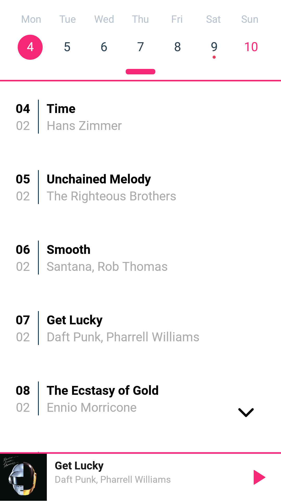

# giornale

Android app to discover one song per day. 

<kbd>  </kbd>
<kbd>  </kbd>
<kbd>  </kbd>

### Features

* Tap to reveal today's song
* Interactive calendar
* Scroll left to like the song
* Scroll to the right to open a related Spotify playlist
* Music player with shuffle and mute options

### Frameworks

* [React-native](https://facebook.github.io/react-native/)  - [*0.57.1*]
* [Expo](https://expo.io/) SDK - [*32.0.0*]
* [Firebase](https://firebase.google.com) for storage and database - [*^5.8.1*]
* [React](https://reactjs.org/) - [*16.5.0*]
* [Babel-preset-expo"](https://github.com/expo/expo/tree/master/packages/babel-preset-expo) - ["^5.0.0"]

### Install and run

* Install dependencies
```
npm install -g expo-cli
npm install
```

* Create a file "components/firebase_init.js" with the following content:
```
// Initialize Firebase
export const firebaseConfig = {
  apiKey: "<API_KEY>",
  authDomain: "<PROJECT_ID>.firebaseapp.com",
  databaseURL: "https://<DATABASE_NAME>.firebaseio.com",
  storageBucket: "<BUCKET>.appspot.com"
};
```
* Upload songs files and album images to Firebase Storage and get download url

<kbd>   </kbd>

* Upload json data to Firebase Realtime Database
```json
{
  "data": [
    {
      "date": "2019-02-04",
      "title": "Time",
      "artist": "Hans Zimmer",
      "album": "Inception",
      "spotify": "spotify:playlist:37i9dQZF1DWWF3yivn1m3D",
      "id": 0,
      "opened": false,
      "liked": false,
      "albumImage": "<Link to .mp3 song file in Firebase Storage>",
      "songFile": "<Link to .jpg image file in Firebase Storage>"
    },
    {},
 ]  
}
```

* Run:
```
npm start
```

## Authors

* [Iñigo Martinez](https://imartinezl.github.io/)

## License
This project is licensed under the MIT License - see [LICENSE.md](LICENSE.md) file for details

<kbd>  </kbd>


